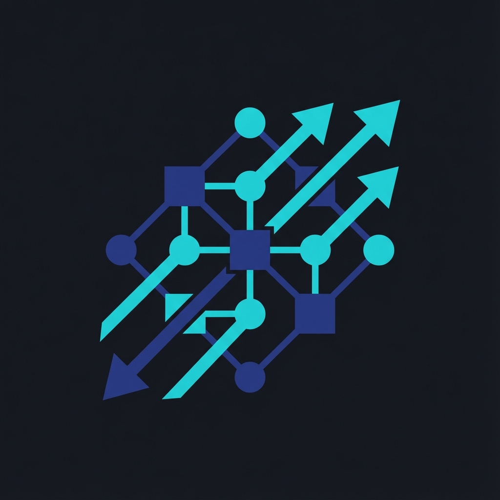

<p align="center">
  
</p>

<h1 align="center">Barq-GraphDB</h1>

<p align="center">
  A production-grade graph+vector database designed for AI agents
</p>

<p align="center">
  <a href="https://github.com/YASSERRMD/barq-graphdb/releases"></a>
  <a href="https://github.com/YASSERRMD/barq-graphdb/blob/main/LICENSE"></a>
  <a href="https://www.rust-lang.org/"></a>
</p>

---

## Overview

Barq-GraphDB is a high-performance database that combines graph traversal capabilities with vector similarity search. Built in Rust, it provides AI agents with the ability to store structured knowledge, perform hybrid queries, and maintain complete decision audit trails.

### Key Features

- **Graph Storage**: Directed graph with adjacency lists and BFS traversal
- **Vector Index**: HNSW-based similarity search with kNN queries
- **Hybrid Queries**: Combined vector similarity and graph distance scoring
- **Agent Audit Trails**: Decision recording and replay for AI agent transparency
- **Append-Only WAL**: Durable write-ahead log with crash recovery
- **REST API**: JSON-based HTTP interface (port 8080)
- **gRPC API**: High-performance binary protocol (port 50051)
- **CLI Tool**: Command-line interface for database management

## Installation

### From Source

```bash
git clone https://github.com/YASSERRMD/barq-graphdb.git
cd barq-graphdb
cargo build --release
```

### Binaries

After building, two binaries are available:

- `barqg` - Command-line interface
- `barqg_server` - HTTP REST API server

### Docker

```bash
docker pull yasserrmd/barq-graphdb:latest
docker run -d -p 8080:8080 -p 50051:50051 yasserrmd/barq-graphdb
```

The server will be available at:
- **HTTP API**: `http://localhost:8080`
- **gRPC API**: `localhost:50051`

## Client SDKs

Official SDKs are available for multiple languages:

| Language | Location | Installation |
|----------|----------|--------------|
| **Python** | `sdk/python` | `pip install barq-graphdb` |
| **Go** | `sdk/go` | `go get github.com/YASSERRMD/barq-graphdb/sdk/go` |
| **C#** | `sdk/csharp` | `dotnet add package BarqGraphDb` |
| **Node.js** | `sdk/nodejs` | `npm install barq-graphdb` |

See each SDK's README for detailed usage examples.

## Quick Start

### Initialize a Database

```bash
./target/release/barqg init --path ./my_database
```

### Add Nodes

```bash
./target/release/barqg add-node --path ./my_database --id 1 --label "User"
./target/release/barqg add-node --path ./my_database --id 2 --label "Document"
```

### Add Edges

```bash
./target/release/barqg add-edge --path ./my_database --from 1 --to 2 --type "OWNS"
```

### Set Embeddings

```bash
./target/release/barqg set-embedding --path ./my_database --id 1 --vec '[0.1,0.2,0.3]'
```

### Query Neighbors

```bash
./target/release/barqg neighbors --path ./my_database --id 1
```

### Perform Hybrid Query

```bash
./target/release/barqg hybrid --path ./my_database --start 1 --hops 3 --k 5 --vec '[0.1,0.2,0.3]' --alpha 0.7 --beta 0.3
```

## 📊 Benchmarks

See [Full Benchmark Results](docs/BENCHMARK_RESULTS.md) and [Competitive Analysis](docs/COMPETITIVE_ANALYSIS.md).

- **Write**: ~28,000 vectors/sec (Async Indexing)
- **Search**: < 1ms Latency (HNSW Hybrid)
- **Lookup**: 89ns / op

## HTTP API

Start the server:

```bash
./target/release/barqg_server --path ./my_database --host 127.0.0.1 --port 8080 --grpc-port 50051
```

### Endpoints

| Endpoint | Method | Description |
|----------|--------|-------------|
| `/health` | GET | Health check and version info |
| `/stats` | GET | Database statistics |
| `/nodes` | GET | List all nodes |
| `/nodes` | POST | Create a new node |
| `/edges` | POST | Create a new edge |
| `/embeddings` | POST | Set node embedding |
| `/query/hybrid` | POST | Execute hybrid query |
| `/decisions` | GET | List agent decisions |
| `/decisions` | POST | Record agent decision |

### Example: Create Node

```bash
curl -X POST http://localhost:8080/nodes \
  -H "Content-Type: application/json" \
  -d '{"id": 1, "label": "User", "embedding": [0.1, 0.2, 0.3]}'
```

### Example: Hybrid Query

```bash
curl -X POST http://localhost:8080/query/hybrid \
  -H "Content-Type: application/json" \
  -d '{
    "start": 1,
    "max_hops": 3,
    "k": 5,
    "query_embedding": [0.1, 0.2, 0.3],
    "alpha": 0.7,
    "beta": 0.3
  }'
```

## Library Usage

Add to your `Cargo.toml`:

```toml
[dependencies]
barq_graphdb = { git = "https://github.com/YASSERRMD/barq-graphdb" }
```

### Example

```rust
use barq_graphdb::storage::{BarqGraphDb, DbOptions};
use barq_graphdb::hybrid::HybridParams;
use barq_graphdb::Node;
use std::path::PathBuf;

fn main() -> anyhow::Result<()> {
    // Open database
    let opts = DbOptions::new(PathBuf::from("./my_db"));
    let mut db = BarqGraphDb::open(opts)?;

    // Add nodes
    db.append_node(Node::new(1, "User".to_string()))?;
    db.append_node(Node::new(2, "Document".to_string()))?;

    // Add edge
    db.add_edge(1, 2, "OWNS")?;

    // Set embeddings
    db.set_embedding(1, vec![0.1, 0.2, 0.3])?;
    db.set_embedding(2, vec![0.2, 0.3, 0.4])?;

    // Hybrid query
    let params = HybridParams::new(0.7, 0.3);
    let results = db.hybrid_query(&[0.1, 0.2, 0.3], 1, 3, 5, params);

    for result in results {
        println!("Node {}: score={:.3}, path={:?}", 
            result.id, result.score, result.path);
    }

    Ok(())
}
```

## Architecture

### Storage Layer

- **Write-Ahead Log (WAL)**: JSON-encoded append-only log for durability
- **In-Memory Index**: HashMap-based node storage for fast lookups
- **Adjacency Lists**: Efficient graph traversal with O(1) neighbor access

### Vector Index

- **HNSW Index**: Hierarchical Navigable Small World graph for O(log N) similarity search
- **Linear Scan**: Fallback for small datasets (configurable)
- **L2 Distance**: Euclidean distance metric

### Hybrid Scoring

The hybrid score combines vector similarity and graph distance:

```
score = alpha * (1 - normalized_vector_distance) + beta * (1 / (1 + graph_distance))
```

- `alpha`: Weight for vector similarity (0.0 to 1.0)
- `beta`: Weight for graph proximity (0.0 to 1.0)

## Agent Decision Tracking

Record and audit AI agents:

```rust
use barq_graphdb::agent::DecisionRecord;

let decision = DecisionRecord::new(
    1,                      // decision_id
    42,                     // agent_id
    100,                    // root_node
    vec![100, 101, 102],    // path taken
    0.95                    // confidence score
).with_notes("Vulnerability cascade analysis".to_string());

db.record_decision(decision)?;

// Later, retrieve decisions for audit
let agent_decisions = db.list_decisions_for_agent(42);
```

## Testing

Run the test suite:

```bash
cargo test
```

Run with verbose output:

```bash
cargo test -- --nocapture
```

## Project Structure

```
barq-graphdb/
├── src/
│   ├── lib.rs           # Library entry point
│   ├── storage.rs       # Core storage and WAL
│   ├── graph.rs         # Graph index and BFS
│   ├── vector.rs        # Vector index and kNN
│   ├── hybrid.rs        # Hybrid query scoring
│   ├── agent.rs         # Decision records
│   ├── api.rs           # HTTP handlers
│   ├── error.rs         # Error types
│   └── bin/
│       ├── barqg.rs         # CLI binary
│       └── barqg_server.rs  # HTTP server binary
├── tests/
│   ├── integration_test_phase0.rs
│   ├── integration_test_phase1.rs
│   ├── integration_test_phase2.rs
│   ├── integration_test_phase3.rs
│   └── integration_test_phase4.rs
├── Cargo.toml
└── README.md
```

## Performance Considerations

- **Node Lookups**: O(1) via HashMap
- **Neighbor Access**: O(1) via adjacency lists
- **BFS Traversal**: O(V + E) where V = visited nodes, E = edges
- **kNN Search**: O(log n) HNSW search (sub-ms at scale)
- **WAL Writes**: Async vector indexing ensures non-blocking writes

## Limitations

- Single-process architecture (embedded or sidecar)
- No built-in clustering or sharding

## License

This project is licensed under the MIT License. See [LICENSE](LICENSE) for details.

## Author

Developed by [YASSERRMD](https://github.com/YASSERRMD)
